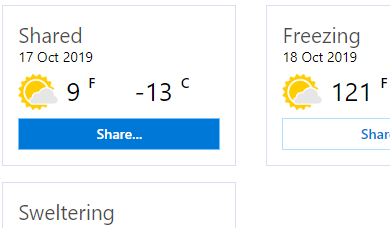

Similar to a single card, Card Collections can handle OpenUrl-action automatically but Submit-action must be handled using code. And similar to a single card, **OnSubmitAction** and **SubmitHandler** can be used to handle submit.

When using OnSubmitAction or SubmitHandler with a Card Collection, you get access to the model which is bound against the card.

Here's an example of OnSubmitAction:

```html {.line-numbers}
<CardCollection OnSubmitAction="@SendEmail" Models="@forecasts" Schema="@Schemas.WeatherTemplated"></CardCollection>
...
@code {
    ...
    public void SendEmail(AdaptiveCards.Blazor.Actions.SubmitEventArgs eventArgs)
    {
        var details = new { eventArgs.Action, eventArgs.Data, eventArgs.Model };
    }
}
```

SubmitEventArgs can be used to access the following data: The name of the submit action, the submitted data, the model and the AdaptiveCard.

SubmitHandler makes some things easier as it supports model binding. Here's an example of using SubmitHandler with CardCollection:

```html {.line-numbers}
<CardCollection SubmitHandler="this" Models="@forecasts" Schema="@Schemas.WeatherTemplated"></CardCollection>
...
@code {
    ...
    public Task Submit(WeatherForecast model, string emailAddress, TemplatedAdaptiveCard card)
    {
        var details = new { emailAddress, model };
 
        StateHasChanged();

        return Task.CompletedTask;
    }
}
```

### Rerendering card

As mentioned above, you can access to underlying model when Submit action is executed. This means that you can modify the model. For performance reasons CardCollection doesn't rerender cards when a submit action is handled, meaning if you modify the model, your card won't show the changes. But you can direct the CardCollection to rerender a single card. 

Here's an example where a Submit action is executed which then modifies the model. A rerender updated the visible card:

```html {.line-numbers}
<CardCollection OnSubmitAction="@SendEmailReRender" Models="@forecasts" Schema="@Schemas.WeatherTemplated"></CardCollection>
...
@code {
    ...
    public void SendEmailReRender(AdaptiveCards.Blazor.Actions.SubmitEventArgs eventArgs)
    {
        var details = new { eventArgs.Action, eventArgs.Data, eventArgs.Model };
 
        selectedForecast = (WeatherForecast)eventArgs.Model;
        selectedForecast.Summary = "Shared";

        eventArgs.AdaptiveCard.ShouldReRender = true;
    }
}
```

