## Introduction

Adaptive Cards for Blazor is community project which provides Adaptive Cards support for Blazor. The library targets the server side version of Blazor, which was released in .NET Core 3.0. This tutorials gives you a run through of how to build a Blazor application which uses Adaptive Cards.

This tutorial is split into two parts: In the first part a card with actions is created. In the second part the card collection capabilities of Adaptive Cards for Blazor are introduced.

## The Goal

The goal of this tutorial is to create a Blazor application which contains weather cards. In the first part we create and display a single weather card:

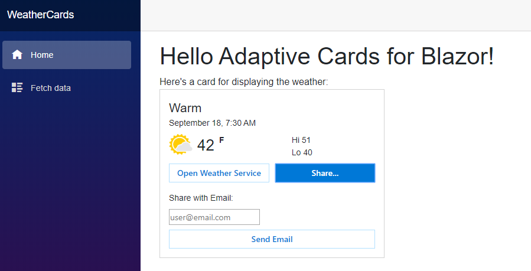

In the second part of the tutorial we create a card collection and display weather forecasts:

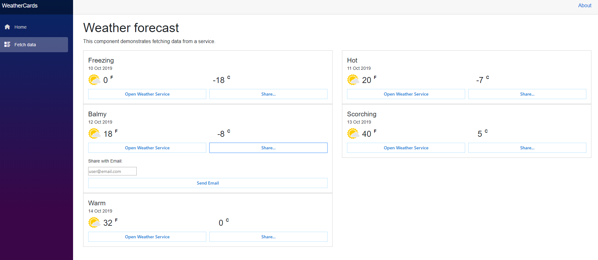

We start by creating a new Blazor Application using Visual Studio and then work our way step-by-step until we have adaptive weather cards rendereded on the page.

The full source code for this tutorial is [available from GitHub](https://github.com/mikoskinen/Blazor.AdaptiveCards/tree/master/samples/WeatherCards).

### The Starting Point

Create a new Blazor App in Visual Studio 2019:


Give your app a name. In this tutorial the app is called "WeatherCards":


Create the app as a Blazor Server App:


If you now run the app using F5, you should see the default Server Side Blazor app:


Next, we will start modifying the default app so that it can be used to display Adaptive Cards.

### Adding the Adaptive Cards for Blazor package

Adaptive Cards for Blazor is available as a NuGet package. The package is called [AdaptiveCardsBlazor](https://www.nuget.org/packages/AdaptiveCardsBlazor/).

Install the latest version of the package through project's context menu:


Browse for packages and type in AdaptiveCardsBlazor as the search text. Select and install the package:


Adaptive Cards for Blazor uses the official Adaptive Cards for .NET SDK and because of this, other packages are added into the app. After installing the package, you should see AdaptiveCardsBlazor in the dependencies:


Now that we have the package installed, there's only few configuration settings needed in order to start displaying Adaptive Cards. 

### Configuring the Blazor App for Adaptive Cards

First part of the configuration is modifying ConfigureServices method of the **Startup.cs**. By default, this is how the Startup.cs should look like:

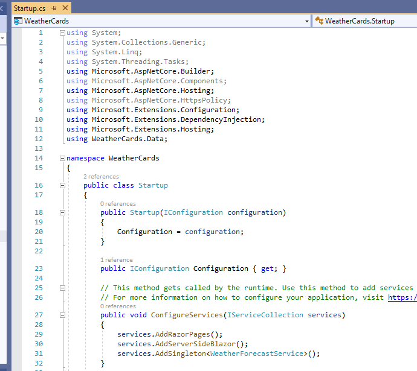

We modify this by adding a new line into the end of the method:

```csharp {.line-numbers}
services.AddBlazorAdaptiveCards();
```

This is how the file should now look like:


Another part of the configuration is adding the required JavaScript interop-file into the _Host.cshtml. Even though .NET is used to create the cards, few lines of JavaScript is used to handle the button clicks. Fear not though, you don't have to write JavaScript in order to use Adaptive Cards for Blazor. The JavaScript is used only internally by the library.

The requires JS-file is added into the head-part of the **_Host.cshtml**:

```html
    <script src="_content/AdaptiveCardsBlazor/adaptiveCardsJsInterop.js"></script>
```

Making the _Host.cshtml look like the following:

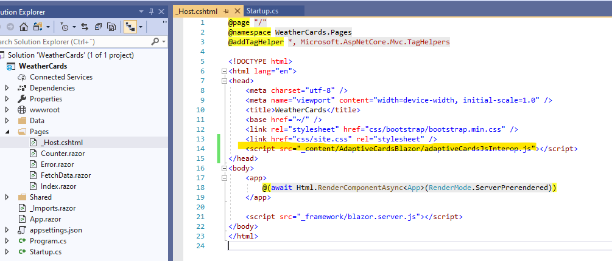

And we're done! Those two changes are the only ones needed. To make it easier to use the components provided by Adaptive Cards for Blazor, we also modify the **_Imports.razor** file. Here's the line which is added into the end of the file:

```csharp
    @using AdaptiveCards.Blazor
```

And here's a look of the file after the edit:


Now that we have everything set up, it's almost time to start drawing some cards. But before that, we need a schema.

### The schema

An adaptive card is presented by a JSON Schema. To get a better understanding of the schema, the [Adaptive Cards' sample site](https://adaptivecards.io/samples/) contains nearly 20 different schemas to go through. When you find an interesting schema, you can copy and paste it into the [Adaptive Cards Designer](https://adaptivecards.io/designer/). The designer allows you to edit the schema and see the changes real time.

Another good introduction to the possibilities of Adaptive Cards is [Schema Explorer](https://adaptivecards.io/explorer/).

Here's the JSON-schema we will be using in this tutorial:

```json {.line-numbers}
{
  "$schema": "http://adaptivecards.io/schemas/adaptive-card.json",
  "type": "AdaptiveCard",
  "version": "1.0",
  "body": [
    {
      "type": "TextBlock",
      "text": "Warm",
      "size": "large",
      "isSubtle": true
    },
    {
      "type": "TextBlock",
      "text": "September 18, 7:30 AM",
      "spacing": "none"
    },
    {
      "type": "ColumnSet",
      "columns": [
        {
          "type": "Column",
          "width": "auto",
          "items": [
            {
              "type": "Image",
              "url": "http://messagecardplayground.azurewebsites.net/assets/Mostly%20Cloudy-Square.png",
              "size": "small"
            }
          ]
        },
        {
          "type": "Column",
          "width": "auto",
          "items": [
            {
              "type": "TextBlock",
              "text": "42",
              "size": "extraLarge",
              "spacing": "none"
            }
          ]
        },
        {
          "type": "Column",
          "width": "stretch",
          "items": [
            {
              "type": "TextBlock",
              "text": "F",
              "weight": "bolder",
              "spacing": "small"
            }
          ]
        },
        {
          "type": "Column",
          "width": "stretch",
          "items": [
            {
              "type": "TextBlock",
              "text": "Hi 51",
              "horizontalAlignment": "left"
            },
            {
              "type": "TextBlock",
              "text": "Lo 40",
              "horizontalAlignment": "left",
              "spacing": "none"
            }
          ]
        }
      ]
    }
  ]
}
```
The schema is the WeatherCompact sample from the [Adaptive Cards' samples site](https://adaptivecards.io/samples/WeatherCompact.html).

### Adding the Schema into the App

The Adaptive Card's schema often comes into your application through some API or an endpoint. As we are only creating a client app in this guide, we will store the schema as a file. This file will be part of the project and we can read it from the disk when needed. Use Visual Studio's Add Item to create a new file:


Select JSON file as the type and give the file a meaningful name, "WeatherSchema.json" in this case:

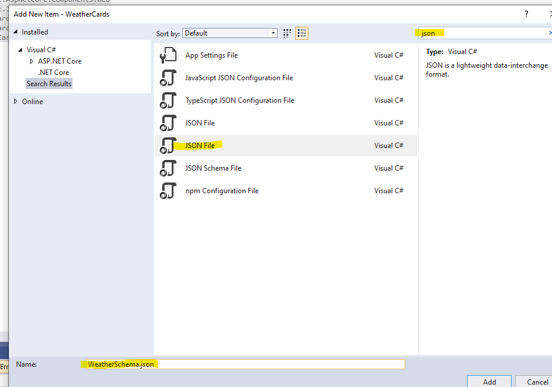

Copy-paste the schema displayed above into the file:


We now have our schema. In order for our app to be able to read it, we must make sure that the file is copied into the application's run directory. Select the file's properties and make sure that it's set to "Copy if newer":


The property can be tested by building the app. After the build, WeatherSchema.json should be found from the application's bin\debug\netcore3.0 folder:


Now, it's time to display the card.

### Displaying the card

Here's the checklist so far:

* Nuget package
* ConfigureServices
* JS interop
* Imports
* The schema

Everything should be ready so it's time to draw our first card. Open the **Index.razor** for editing. Here's how it looks by default:

```csharp {.line-numbers}
@page "/"

<h1>Hello, world!</h1>

Welcome to your new app.
```
Let's edit this to add our first card:

```html {.line-numbers}
@page "/"

<h1>Hello Adaptive Cards for Blazor!</h1>

Here's a card for displaying the weather:

<div class="row">
    <div class="col-3">
        <AdaptiveCard Schema="@schema"></AdaptiveCard>
    </div>
</div>
```

Adaptive Cards by default use all the horizontal space they can get so in this case we use Bootstrapper's col-3 to make the card smaller.

Running the application doesn't work just yet: We have to load the schema from the file. This can be done in the code-section of the **Index.razor**:

```csharp {.line-numbers}
@code{
    string schema = "";

    protected override void OnInitialized()
    {
        schema = System.IO.File.ReadAllText("WeatherSchema.json");
    }
}
```

And here's a full look of the content of the file:


Now, run/F5 the application and we should have our first Adaptive Card visible!


Before we start adding new features, let's add some tweaks to the project to make the cards little prettier.

### Modernizing the look

The card by default looks OK, but it feels little out of the place without any borders. Let's fix that by modifying the site's CSS-file, located in **wwwroot/css/site.css**. Each card automatically has the "ac-adaptivecard" class which we can target from our styles:

```css {.line-numbers}
.ac-adaptivecard {
    border: solid 1px lightgray;
}
```

Now when run, the card should be wrapped inside a border:


The fonts and styling are still little of, if compared to the Adaptive Cards' samples. The sample site uses a stylesheet called "outlook.css" to make the cards pretty. This file is available from the [GitHub](https://github.com/microsoft/AdaptiveCards/blob/master/source/nodejs/adaptivecards-designer/src/containers/outlook/outlook-container.css). We can either download the file and add it as an additional stylesheet into our application or either copy-paste the content into the **site.css**. In this tutorial the content is copy-pasted under the ac-adaptivecard which we just added:


Now we have everything ready. Here's how our card now looks like:


Currently the card just displays information. In the next part we are going to add couple actions into it.

### Adding an OpenUrl action

Adaptive Cards can contain actions. Actions are usually displayed as button and their functionality can range from opening links to confirming booking details. Adaptive Cards support four types of actions:

* **[OpenUrl](https://adaptivecards.io/explorer/Action.OpenUrl.html)**: An action which opens a link (href)
* **[Submit](https://adaptivecards.io/explorer/Action.Submit.html)**: Submits input fields (form)
* **[ShowCard](https://adaptivecards.io/explorer/Action.ShowCard.html)**: Cards can contain cards. ShowCard can be used to show and hide an card. Usually used for displaying more detailed data for a particular card.
* **[ToggleVisibility](https://adaptivecards.io/explorer/Action.ToggleVisibility.html)**: Action which can show or hide card elements.

Adaptive Cards for Blazor supports three types of actions: OpenUrl, Submit and ShowCard. Support for ToggleVisibility is coming on the next version.

Adding an OpenUrl action is just a matter of adding couple new lines into our schema. Currently our card's schema only contains the **"body"** element. Now we add a new **"actions"** element in it. Actions inside the actions-element are rendered at the bottom of the card. Here's how to define an empty actions element:

```json {.line-numbers}
"body": [
  ...
],
"actions": [
]
```

To add an OpenUrl which takes us to Weather.com, we add an action of type Action.OpenUrl:

```json {.line-numbers}
"body": [
  ...
],
"actions": [
  {
    "type": "Action.OpenUrl",
    "title": "Open Weather Service",
    "url": "https://weather.com"
  }
]
```

Here's our card when the application is run:


When the button is clicked, the browser navigates to the defined URL, in this case https://weather.com.

### Adding a Submit & ShowCard actions

Submit actions are quite likely the most popular actions in Adaptive Cards. They allow you to gather some input from the user, like their name and address, and then to submit that data into your desired endpoint. 

The [Inputs sample](https://adaptivecards.io/samples/Inputs.html) at the Adaptive Cards' sample site gives a good representation of different input controls which are available through the schema:

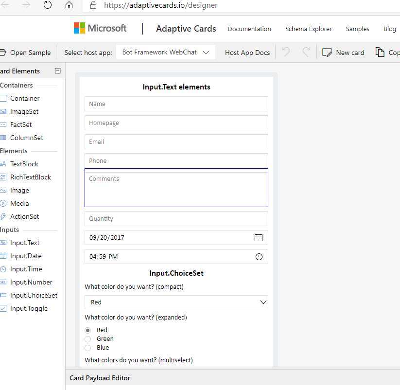

We are going to use Submit action to add "Share"-functionality into our app. But as we like to keep the main view of our card simple, we will use a ShowCard-action to display the sharing functionality. The idea is that by default the sharing functionality is hidden:


When the user clicks the "Share"-button, the card is expanded with the help of ShowCard:


Here's the updated actions-element from our schema:

```json {.line-numbers}
"body": [
  ...
],
"actions": [
  {
    "type": "Action.OpenUrl",
    "title": "Open Weather Service",
    "url": "https://weather.com"
  },
  {
    "type": "Action.ShowCard",
    "title": "Share...",
    "card": {
      "type": "AdaptiveCard",
      "body": [
        {
          "type": "TextBlock",
          "text": "Share with Email:"
        },
        {
          "type": "Input.Text",
          "id": "emailAddress",
          "placeholder": "user@email.com"
        }
      ],
      "actions": [
        {
          "type": "Action.Submit",
          "title": "Send Email"
        }
      ]
    }
  }
]
```
Now we have the desired UI but the Submit doesn't actually do anything. In Adaptive Cards for Blazor, Submit actions are handled using C#. As a reminder, here's how the **Index.razor** currently looks:

```charp {.line-numbers}
@page "/"

<h1>Hello Adaptive Cards for Blazor!</h1>

Here's a card for displaying the weather:

<div class="row">
    <div class="col-3">
        <AdaptiveCard Schema="@schema"></AdaptiveCard>
    </div>
</div>

@code{
    string schema = "";

    protected override void OnInitialized()
    {
        schema = System.IO.File.ReadAllText("WeatherSchema.json");
    }
}
```

In order to handle the Submit, we must provide a submit method for the AdaptiveCard-component. This happens through **OnSubmitAction**:
```csharp {.line-numbers}
<div class="row">
    <div class="col-3">
        <AdaptiveCard Schema="@schema" OnSubmitAction="@SendEmail"></AdaptiveCard>
    </div>
</div>

@code{
    string schema = "";

    protected override void OnInitialized()
    {
        schema = System.IO.File.ReadAllText("WeatherSchema.json");
    }

    public void SendEmail(AdaptiveCards.Blazor.Actions.SubmitEventArgs eventArgs)
    {

    }
}
```

The event args contains the name of the submitted action (if the schema defines one) and the submitted data. In our case the submit data only contains one input: emailAddress:


The values are in the form of Dictionary<string, object>. Here's a code which reads the submitted email address and displayes it under the card:

```csharp {.line-numbers}
<div class="row">
    <div class="col-3">
        <AdaptiveCard Schema="@schema" OnSubmitAction="@SendEmail"></AdaptiveCard>
    </div>
</div>

@if (!string.IsNullOrWhiteSpace(submittedTo))
{
    <b>Email submitted to:</b> @submittedTo
}

@code{
    string schema = "";
    string submittedTo = "";

    protected override void OnInitialized()
    {
        schema = System.IO.File.ReadAllText("WeatherSchema.json");
    }

    public void SendEmail(AdaptiveCards.Blazor.Actions.SubmitEventArgs eventArgs)
    {
        submittedTo = eventArgs.Data["emailAddress"].ToString();
    }
}
```

And here's how the applications looks like after submitting the data:

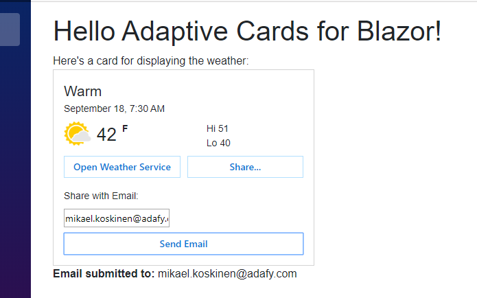

Adaptive Cards for Blazor offers multiple ways of handling the submitted data. One of them is model binding. Instead of having to get the desired values from a Dictionary, Adaptive Cards for Blazor can automatically bind the values into method parameters. For this to work, we replace the **OnSubmitAction** from the card with **SubmitHandler**. Also **SendEmail** method is replaced with **Submit**:

```csharp {.line-numbers}
<div class="row">
    <div class="col-3">
        <AdaptiveCard Schema="@schema" SubmitHandler="this"></AdaptiveCard>
    </div>
</div>

@if (!string.IsNullOrWhiteSpace(submittedTo))
{
    <b>Email submitted to:</b> @submittedTo
}

@code{
    string schema = "";
    string submittedTo = "";

    protected override void OnInitialized()
    {
        schema = System.IO.File.ReadAllText("WeatherSchema.json");
    }

    public Task Submit(string emailAddress)
    {
        submittedTo = emailAddress;

        StateHasChanged();
        return Task.CompletedTask;
    }
}
```

Note that the Submit method currently has to return Task. It's possible that in future also void methods can be used. Also, StateHasChanged must be manually called, if the component needs updating.

This produces an identical result as the previous example:

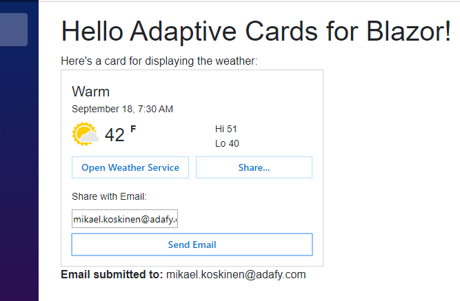

This concludes the first part of our tutorial. In this tutorial we set-up our Blazor app to support Adaptive Cards for Blazor. Then we created a card schema using JSON. Lastly, we added three different actions into our card.

The next part of this tutorial is a shorter one. It continues from the first part and shows how you can use Card Collections: Adaptive Cards for Blazor's way of rendering multiple cards.

## Card Collections

Adaptive Cards for Blazor has a feature called Card Collections. Card Collections allow the developer to easily display a list of cards based on two things: **A model** and **a template**. Model can be any .NET object, like a Customer, Invoice or WeatherInf. Template is a JSON schema. Card Collection takes a list of models, for example List<WeatherInfo> and the template and then binds each model against the schema. The end result is then rendered on the screen. Sounds harder than it is.

*Note*: The templating support in Adaptive Cards for Blazor is a custom-built solution, based on the [Scriban](https://github.com/lunet-io/scriban) templating language. Adaptive Cards should at some point receive a native templating support.

Here's a quick reminder of how our weather schema displays the temperatures:

```json {.line-numbers}
        {
          "type": "Column",
          "width": "auto",
          "items": [
            {
              "type": "TextBlock",
              "text": "42",
              "size": "extraLarge",
              "spacing": "none"
            }
          ]
        }
```

Here's a slightly modified version of the schema where the "42" is replaced with binding:

```json {.line-numbers}
        {
          "type": "Column",
          "width": "auto",
          "items": [
            {
              "type": "TextBlock",
              "text": "{{ TemperatureF }}",
              "size": "extraLarge",
              "spacing": "none"
            }
          ]
        },
```

And here's our C# class (the model) which we will bind against the card:

```charp {.line-numbers}
    public class WeatherForecast
    {
        public DateTime Date { get; set; }

        public int TemperatureC { get; set; }

        public int TemperatureF => 32 + (int)(TemperatureC / 0.5556);

        public string Summary { get; set; }
    }
```

Our current Blazor App already have a page which displays weather forecasts but in a rather plain format:


In this tutorial we will modify the page so that instead of a table, we get a nice collection of cards:

### Creating the Templated Schema

First we need to have a schema which enables the templating. For this we copy-paste the existing WeatherSchema.json into **WeatherSchemaTemplate.json**:

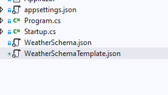

The schema currently has the following information hard coded:
* Weather summary
* Date
* Image
* Current weather in fahrenheits
* Temperature range for the day

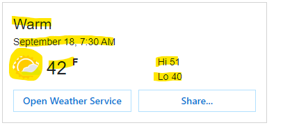

As we already have an existing WeatherForecastService, we don't want to do any changes into it. Instead we tweak the card a little: Instead of displaying the temperature range, we display the weather in celcius. To make sure we get the schema correct before adding the templating support, we modify **WeatherSchemaTemplate.json** to display the temperature in celsius. Where we previously had:

```json {.line-numbers}
        {
          "type": "Column",
          "width": "stretch",
          "items": [
            {
              "type": "TextBlock",
              "text": "Hi 51",
              "horizontalAlignment": "left"
            },
            {
              "type": "TextBlock",
              "text": "Lo 40",
              "horizontalAlignment": "left",
              "spacing": "none"
            }
          ]
        }
```

Is changed to the following:

```json {.line-numbers}
        {
          "type": "Column",
          "width": "auto",
          "items": [
            {
              "type": "TextBlock",
              "text": "20",
              "size": "extraLarge",
              "spacing": "none"
            }
          ]
        },
        {
          "type": "Column",
          "width": "stretch",
          "items": [
            {
              "type": "TextBlock",
              "text": "C",
              "weight": "bolder",
              "spacing": "small"
            }
          ]
        }
```

This will give us an output similar to this:

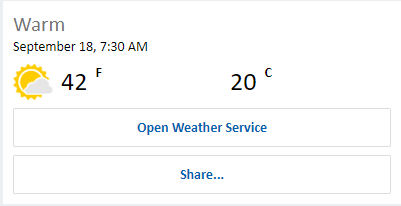

Now that we have the schema, we will modify it that is supports the templating. The syntax for template is:

```json
{{ PropertyName }}
```

Here's again our model:

```csharp
    public class WeatherForecast
    {
        public DateTime Date { get; set; }

        public int TemperatureC { get; set; }

        public int TemperatureF => 32 + (int)(TemperatureC / 0.5556);

        public string Summary { get; set; }
    }
```

So the syntax for displaying property **TemperatureC** in our card is:

```json
{{ TemperatureC }}
```

The first change we need to make into our schema is to remove the hard-coded "warm" and to replace it with value of Summary. This is the original schema:

```json {.line-numbers}
    {
      "type": "TextBlock",
      "text": "Warm",
      "size": "large",
      "isSubtle": true
    },
```

And here's the same part modified to support templating:

```json {.line-numbers}
    {
      "type": "TextBlock",
      "text": "{{ Summary }}",
      "size": "large",
      "isSubtle": true
    },
```

After going through our schema and replacing everything else except the hard-coded image, here's the full outcome:

```json {.line-numbers}
{
  "$schema": "http://adaptivecards.io/schemas/adaptive-card.json",
  "type": "AdaptiveCard",
  "version": "1.0",
  "body": [
    {
      "type": "TextBlock",
      "text": "{{ Summary }}",
      "size": "large",
      "isSubtle": true
    },
    {
      "type": "TextBlock",
      "text": "{{ Date }}",
      "spacing": "none"
    },
    {
      "type": "ColumnSet",
      "columns": [
        {
          "type": "Column",
          "width": "auto",
          "items": [
            {
              "type": "Image",
              "url": "http://messagecardplayground.azurewebsites.net/assets/Mostly%20Cloudy-Square.png",
              "size": "small"
            }
          ]
        },
        {
          "type": "Column",
          "width": "auto",
          "items": [
            {
              "type": "TextBlock",
              "text": "{{ TemperatureF }}",
              "size": "extraLarge",
              "spacing": "none"
            }
          ]
        },
        {
          "type": "Column",
          "width": "stretch",
          "items": [
            {
              "type": "TextBlock",
              "text": "F",
              "weight": "bolder",
              "spacing": "small"
            }
          ]
        },
        {
          "type": "Column",
          "width": "auto",
          "items": [
            {
              "type": "TextBlock",
              "text": "{{ TemperatureC }}",
              "size": "extraLarge",
              "spacing": "none"
            }
          ]
        },
        {
          "type": "Column",
          "width": "stretch",
          "items": [
            {
              "type": "TextBlock",
              "text": "C",
              "weight": "bolder",
              "spacing": "small"
            }
          ]
        }
      ]
    }
  ],
  "actions": [
    {
      "type": "Action.OpenUrl",
      "title": "Open Weather Service",
      "url": "https://weather.com"
    },
    {
      "type": "Action.ShowCard",
      "title": "Share...",
      "card": {
        "type": "AdaptiveCard",
        "body": [
          {
            "type": "TextBlock",
            "text": "Share with Email:"
          },
          {
            "type": "Input.Text",
            "id": "emailAddress",
            "placeholder": "user@email.com"
          }
        ],
        "actions": [
          {
            "type": "Action.Submit",
            "title": "Send Email"
          }
        ]
      }
    }
  ]
}
```

We now have our templated schema ready and it's time to display the cards.

### Displaying the Card Collection

Currently the weather forecasts are displayed in **FetchData.razor** in a HTML table:

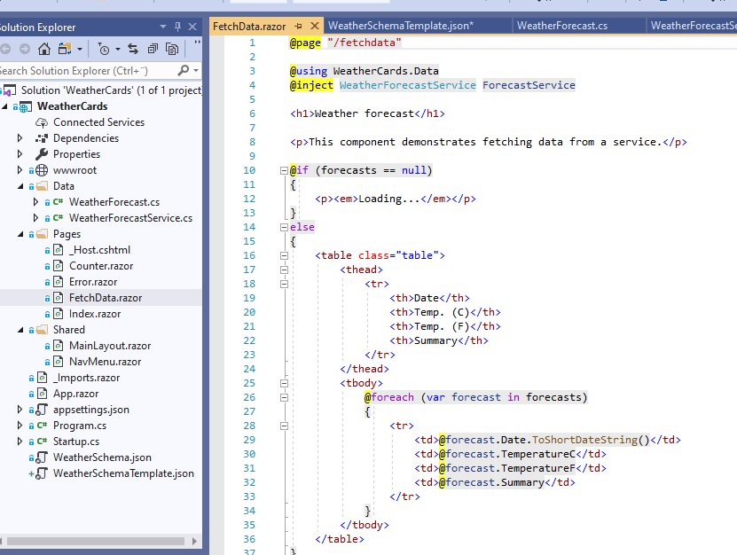

Start by removing the table:

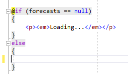

Card Collection can be rendered through AdaptiveCards-component. The component requires three properties: the templated schema, the model type and list of models (objects). List of objects we already have in the form of forecasts:

```csharp
@code {
    WeatherForecast[] forecasts;

    protected override async Task OnInitializedAsync()
    {
        forecasts = await ForecastService.GetForecastAsync(DateTime.Now);
    }
}
```
As in the first part of this tutorial, we will load the schema-file from the disk:

```csharp
@code {
    WeatherForecast[] forecasts;
    string schema;

    protected override async Task OnInitializedAsync()
    {
        forecasts = await ForecastService.GetForecastAsync(DateTime.Now);
        schema = System.IO.File.ReadAllText("WeatherSchemaTemplate.json");
    }
}
```
And here's how we add the AdaptiveCards-component:

```html
    <AdaptiveCards TModel="WeatherForecast" Models="@forecasts.ToList()" Schema="@schema"></AdaptiveCards>
```

FetchData.razor at this point should look like the following:

```html {.line-numbers}
@page "/fetchdata"

@using WeatherCards.Data
@inject WeatherForecastService ForecastService

<h1>Weather forecast</h1>

<p>This component demonstrates fetching data from a service.</p>

@if (forecasts == null)
{
    <p><em>Loading...</em></p>
}
else
{
    <AdaptiveCards TModel="WeatherForecast" Models="@forecasts.ToList()" Schema="@schema"></AdaptiveCards>
}

@code {
    WeatherForecast[] forecasts;
    string schema;

    protected override async Task OnInitializedAsync()
    {
        forecasts = await ForecastService.GetForecastAsync(DateTime.Now);
        schema = System.IO.File.ReadAllText("WeatherSchemaTemplate.json");
    }
}
```

Now, if we run the application, we can see our Card Collection:


It's quite pretty! Card Collection tries not to care what CSS files you are using (Bootstrap vs Material vs custom). Couple classes are still added by default which allows the cards to render nicely when used with Bootstrap: The collection gets the class **"row"** and each of the cards is wrapped inside class **col-3**.

You can use **CardClass** and **Class** properties to configure what classes are applied to the collection and to its content. To make the cards larger, we can change the card class to col-6:

```html {.line-numbers}
    <AdaptiveCards CardClass="col-6" TModel="WeatherForecast" Models="@forecasts.ToList()" Schema="@schema"></AdaptiveCards>
```

This will give us two columns instead of four:

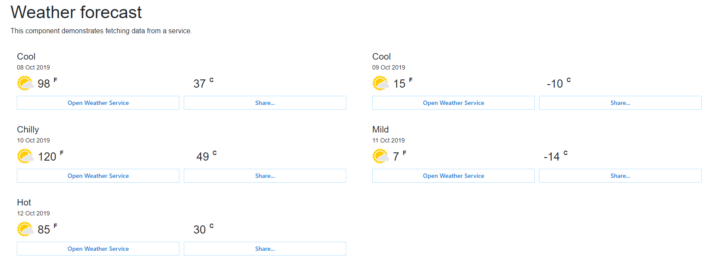

In the next and last section of this tutorial we will add support for handling the actions.

### Handling Actions 

Similar to the first part of this tutorial, our cards contain two actions: OpenLink and Submit action:


The "Open weather service" action is of type OpenLink and it works automatically. But we need to handle manually the "Share..." functionality using C#. As before, we add a little textbox above the component to display information about the action. But this time we "catch" the actual model from the card in order to display information:

```html {.line-numbers}
@if (forecasts == null)
{
    <p><em>Loading...</em></p>
}
else
{
    @if (selectedForecast != null && !string.IsNullOrWhiteSpace(submittedTo))
    {
        <b>@selectedForecast.Date.ToShortDateString(): </b> @submittedTo
    }

    <AdaptiveCards OnSubmitAction="@SendEmail" CardClass="col-6" TModel="WeatherForecast" Models="@forecasts.ToList()" Schema="@schema"></AdaptiveCards>
}
@code {
    WeatherForecast[] forecasts;
    string schema;
    WeatherForecast selectedForecast = null;
    string submittedTo = null;

    protected override async Task OnInitializedAsync()
    {
        forecasts = await ForecastService.GetForecastAsync(DateTime.Now);
        schema = System.IO.File.ReadAllText("WeatherSchemaTemplate.json");
    }

    public void SendEmail(AdaptiveCards.Blazor.Actions.SubmitEventArgs eventArgs)
    {
        submittedTo = eventArgs.Data["emailAddress"].ToString();
        selectedForecast = (WeatherForecast)eventArgs.Model;
    }
}    
```

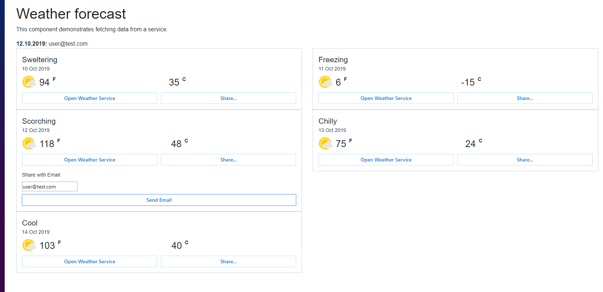

## Next Steps

That concludes our getting started guide. We covered lots of features like templating, handling actions and card collections. There's still a whole lot of features we didn't cover in this tutorial, including animating the cards and using template selectors and template providers.

Hope you enjoy using Adaptive Cards for Blazor! Let us know if you have any issues or feature requests through our project's home page on [GitHub](https://github.com/mikoskinen/Blazor.AdaptiveCards).