## Introduction

Adaptive Cards for Blazor targets the server side version of Blazor, which was released in .NET Core 3.0. This tutorials gives you a quick run through of how to build a Blazor application which uses Adaptive Cards.

This tutorial is split into two parts: In the first part a card with actions is created. In the second part the card collection capabilities of Adaptive Cards for Blazor are introduced.

### The Goal

The goal of this tutorial is to create a Blazor application which contains weather cards.

### The Starting Point

Create a new Blazor App in Visual Studio 2019:


Give your app a name. In this tutorial the app is called "WeatherCards":

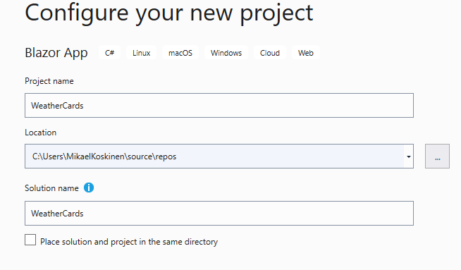

Create the app as a Blazor Server App:


If you now run the app using F5, you should see the default Server Side Blazor app:

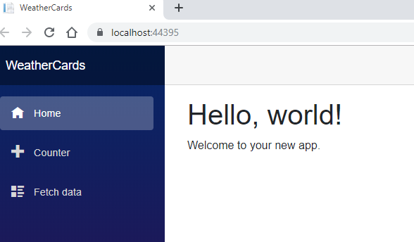

Next, we will start modifying the default app so that it can be used to display Adaptive Cards.

### Adding the Adaptive Cards for Blazor package

Adaptive Cards for Blazor is available as a NuGet package. The package is called [AdaptiveCardsBlazor](https://www.nuget.org/packages/AdaptiveCardsBlazor/).

Install the latest version of the package through project's context menu:

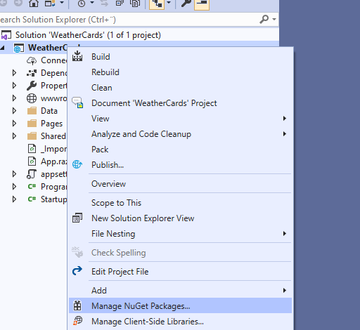

Browse for packages and type in AdaptiveCardsBlazor as the search text. Select and install the package:


Adaptive Cards for Blazor uses the official Adaptive Cards for .NET SDK and because of this, other packages are added into the app. After installing the package, you should see AdaptiveCardsBlazor in the dependencies:

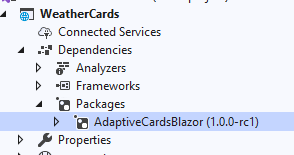

Now that we have the package installed, there's only few configuration settings needed in order to start displaying Adaptive Cards. 

### Configuring the Blazor App for Adaptive Cards

First part of the configuration is modifying ConfigureServices method of the **Startup.cs**. By default, this is how the Startup.cs should look like:


We modify this by adding a new line into the end of the method:

```csharp {.line-numbers}
services.AddBlazorAdaptiveCards();
```

This is how the file should now look like:

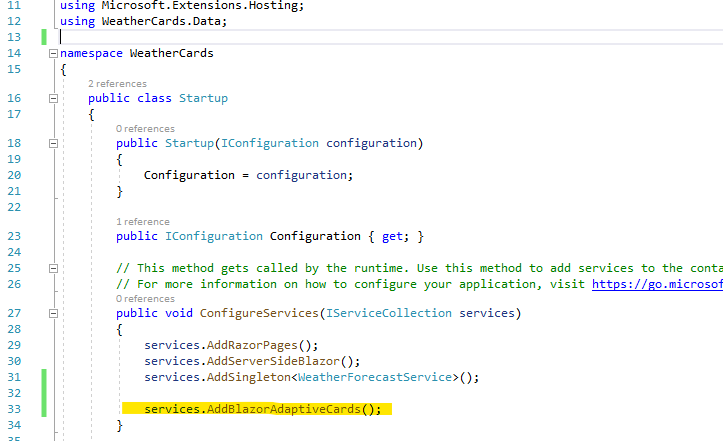

Another part of the configuration is adding the required JavaScript interop-file into the _Host.cshtml. Even though .NET is used to create the cards, few lines of JavaScript is used to handle the button clicks. Fear not though, you don't have to write JavaScript in order to use Adaptive Cards for Blazor. The JavaScript is used only internally by the library.

The requires JS-file is added into the head-part of the **_Host.cshtml**:

```html
    <script src="_content/AdaptiveCardsBlazor/adaptiveCardsJsInterop.js"></script>
```

Making the _Host.cshtml look like the following:


And we're done! Those two changes are the only ones needed. To make it easier to use the components provided by Adaptive Cards for Blazor, we also modify the **_Imports.razor** file. Here's the line which is added into the end of the file:

```csharp
    @using AdaptiveCards.Blazor
```

And here's a look of the file after the edit:

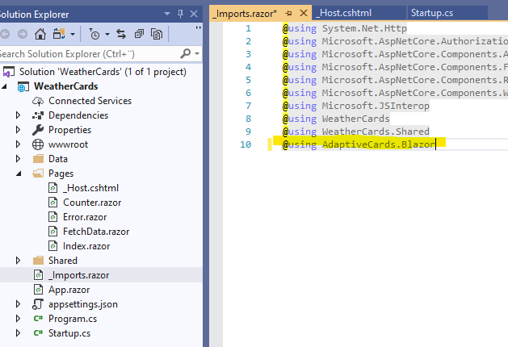

Now that we have everything set up, it's almost time to start drawing some cards. But before that, we need a schema.

### The schema

An adaptive card is presented by a JSON Schema. To get a better understanding of the schema, the [Adaptive Cards' sample site](https://adaptivecards.io/samples/) contains nearly 20 different schemas to go through. When you find an interesting schema, you can copy and paste it into the [Adaptive Cards Designer](https://adaptivecards.io/designer/). The designer allows you to edit the schema and see the changes real time.

Another good introduction to the possibilities of Adaptive Cards is [Schema Explorer](https://adaptivecards.io/explorer/).

Here's the JSON-schema we will be using in this tutorial:

```json {.line-numbers}
{
  "$schema": "http://adaptivecards.io/schemas/adaptive-card.json",
  "type": "AdaptiveCard",
  "version": "1.0",
  "body": [
    {
      "type": "TextBlock",
      "text": "Warm",
      "size": "large",
      "isSubtle": true
    },
    {
      "type": "TextBlock",
      "text": "September 18, 7:30 AM",
      "spacing": "none"
    },
    {
      "type": "ColumnSet",
      "columns": [
        {
          "type": "Column",
          "width": "auto",
          "items": [
            {
              "type": "Image",
              "url": "http://messagecardplayground.azurewebsites.net/assets/Mostly%20Cloudy-Square.png",
              "size": "small"
            }
          ]
        },
        {
          "type": "Column",
          "width": "auto",
          "items": [
            {
              "type": "TextBlock",
              "text": "42",
              "size": "extraLarge",
              "spacing": "none"
            }
          ]
        },
        {
          "type": "Column",
          "width": "stretch",
          "items": [
            {
              "type": "TextBlock",
              "text": "F",
              "weight": "bolder",
              "spacing": "small"
            }
          ]
        },
        {
          "type": "Column",
          "width": "stretch",
          "items": [
            {
              "type": "TextBlock",
              "text": "Hi 51",
              "horizontalAlignment": "left"
            },
            {
              "type": "TextBlock",
              "text": "Lo 40",
              "horizontalAlignment": "left",
              "spacing": "none"
            }
          ]
        }
      ]
    }
  ]
}
```
The schema is the WeatherCompact sample from the [Adaptive Cards' samples site](https://adaptivecards.io/samples/WeatherCompact.html).

### Adding the Schema into the App

The Adaptive Card's schema often comes into your application through some API or an endpoint. As we are only creating a client app in this guide, we will store the schema as a file. This file will be part of the project and we can read it from the disk when needed. Use Visual Studio's Add Item to create a new file:

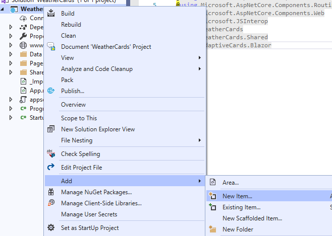

Select JSON file as the type and give the file a meaningful name, "WeatherSchema.json" in this case:


Copy-paste the schema displayed above into the file:

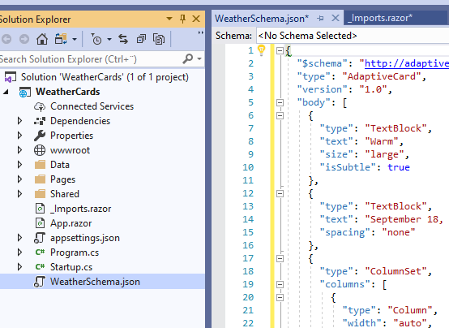

We now have our schema. In order for our app to be able to read it, we must make sure that the file is copied into the application's run directory. Select the file's properties and make sure that it's set to "Copy if newer":

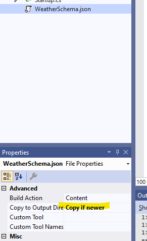

The property can be tested by building the app. After the build, WeatherSchema.json should be found from the application's bin\debug\netcore3.0 folder:

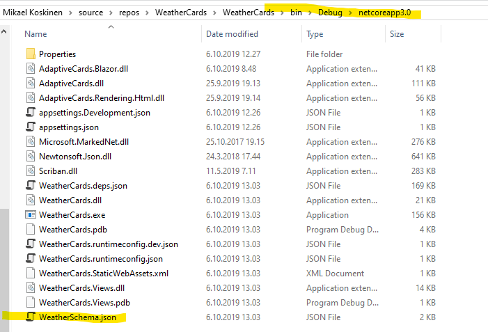

Now, it's time to display the card.

### Displaying the card

Here's the checklist so far:

* Nuget package
* ConfigureServices
* JS interop
* Imports
* The schema

Everything should be ready so it's time to draw our first card. Open the **Index.razor** for editing. Here's how it looks by default:

```csharp {.line-numbers}
@page "/"

<h1>Hello, world!</h1>

Welcome to your new app.
```
Let's edit this to add our first card:

```html {.line-numbers}
@page "/"

<h1>Hello Adaptive Cards for Blazor!</h1>

Here's a card for displaying the weather:

<div class="row">
    <div class="col-3">
        <AdaptiveCard Schema="@schema"></AdaptiveCard>
    </div>
</div>
```

Adaptive Cards by default use all the horizontal space they can get so in this case we use Bootstrapper's col-3 to make the card smaller.

Running the application doesn't work just yet: We have to load the schema from the file. This can be done in the code-section of the **Index.razor**:

```csharp {.line-numbers}
@code{
    string schema = "";

    protected override void OnInitialized()
    {
        schema = System.IO.File.ReadAllText("WeatherSchema.json");
    }
}
```

And here's a full look of the content of the file:

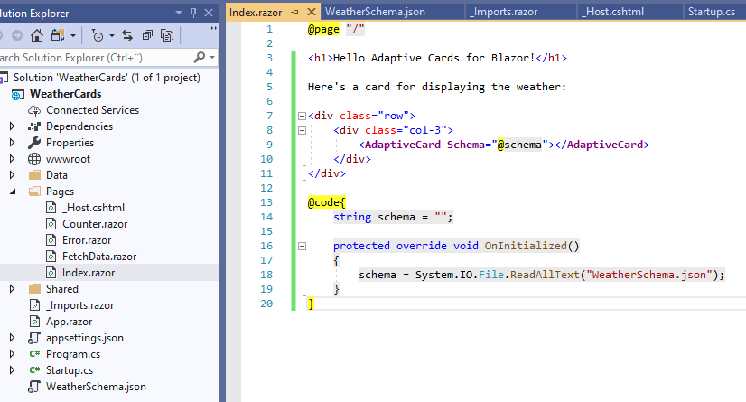

Now, run/F5 the application and we should have our first Adaptive Card visible!


Before we start adding new features, let's add some tweaks to the project to make the cards little prettier.

### Modernizing the look

The card by default looks OK, but it feels little out of the place without any borders. Let's fix that by modifying the site's CSS-file, located in **wwwroot/css/site.css**. Each card automatically has the "ac-adaptivecard" class which we can target from our styles:

```css {.line-numbers}
.ac-adaptivecard {
    border: solid 1px lightgray;
}
```

Now when run, the card should be wrapped inside a border:


The fonts and styling are still little of, if compared to the Adaptive Cards' samples. The sample site uses a stylesheet called "outlook.css" to make the cards pretty. This file is available from the [GitHub](https://github.com/microsoft/AdaptiveCards/blob/master/source/nodejs/adaptivecards-designer/src/containers/outlook/outlook-container.css). We can either download the file and add it as an additional stylesheet into our application or either copy-paste the content into the **site.css**. In this tutorial the content is copy-pasted under the ac-adaptivecard which we just added:


Now we have everything ready. Here's how our card now looks like:

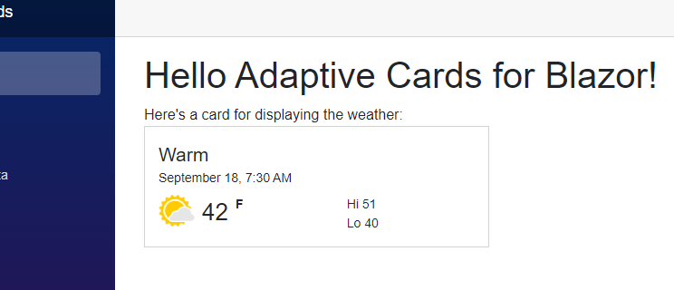

Currently the card just displays information. In the next part we are going to add couple actions into it.

### Adding an OpenUrl action

Adaptive Cards can contain actions. Actions are usually displayed as button and their functionality can range from opening links to confirming booking details. Adaptive Cards support four types of actions:

* **[OpenUrl](https://adaptivecards.io/explorer/Action.OpenUrl.html)**: An action which opens a link (href)
* **[Submit](https://adaptivecards.io/explorer/Action.Submit.html)**: Submits input fields (form)
* **[ShowCard](https://adaptivecards.io/explorer/Action.ShowCard.html)**: Cards can contain cards. ShowCard can be used to show and hide an card. Usually used for displaying more detailed data for a particular card.
* **[ToggleVisibility](https://adaptivecards.io/explorer/Action.ToggleVisibility.html)**: Action which can show or hide card elements.

Adaptive Cards for Blazor supports three types of actions: OpenUrl, Submit and ShowCard. Support for ToggleVisibility is coming on the next version.

Adding an OpenUrl action is just a matter of adding couple new lines into our schema. Currently our card's schema only contains the **"body"** element. Now we add a new **"actions"** element in it. Actions inside the actions-element are rendered at the bottom of the card. Here's how to define an empty actions element:

```json {.line-numbers}
"body": [
  ...
],
"actions": [
]
```

To add an OpenUrl which takes us to Weather.com, we add an action of type Action.OpenUrl:

```json {.line-numbers}
"body": [
  ...
],
"actions": [
  {
    "type": "Action.OpenUrl",
    "title": "Open Weather Service",
    "url": "https://weather.com"
  }
]
```

Here's our card when the application is run:

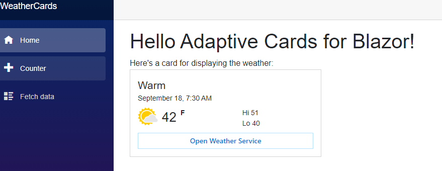

When the button is clicked, the browser navigates to the defined URL, in this case https://weather.com.

### Adding a Submit & ShowCard actions

Submit actions are quite likely the most popular actions in Adaptive Cards. They allow you to gather some input from the user, like their name and address, and then to submit that data into your desired endpoint. 

The [Inputs sample](https://adaptivecards.io/samples/Inputs.html) at the Adaptive Cards' sample site gives a good representation of different input controls which are available through the schema:


We are going to use Submit action to add "Share"-functionality into our app. But as we like to keep the main view of our card simple, we will use a ShowCard-action to display the sharing functionality. The idea is that by default the sharing functionality is hidden:

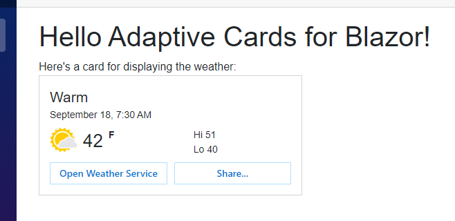

When the user clicks the "Share"-button, the card is expanded with the help of ShowCard:

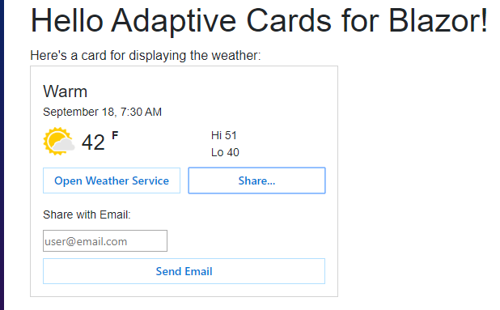

Here's the updated actions-element from our schema:

```json {.line-numbers}
"body": [
  ...
],
"actions": [
  {
    "type": "Action.OpenUrl",
    "title": "Open Weather Service",
    "url": "https://weather.com"
  },
  {
    "type": "Action.ShowCard",
    "title": "Share...",
    "card": {
      "type": "AdaptiveCard",
      "body": [
        {
          "type": "TextBlock",
          "text": "Share with Email:"
        },
        {
          "type": "Input.Text",
          "id": "emailAddress",
          "placeholder": "user@email.com"
        }
      ],
      "actions": [
        {
          "type": "Action.Submit",
          "title": "Send Email"
        }
      ]
    }
  }
]
```
Now we have the desired UI but the Submit doesn't actually do anything. In Adaptive Cards for Blazor, Submit actions are handled using C#. As a reminder, here's how the **Index.razor** currently looks:

```charp {.line-numbers}
@page "/"

<h1>Hello Adaptive Cards for Blazor!</h1>

Here's a card for displaying the weather:

<div class="row">
    <div class="col-3">
        <AdaptiveCard Schema="@schema"></AdaptiveCard>
    </div>
</div>

@code{
    string schema = "";

    protected override void OnInitialized()
    {
        schema = System.IO.File.ReadAllText("WeatherSchema.json");
    }
}
```

In order to handle the Submit, we must provide a submit method for the AdaptiveCard-component. This happens through **OnSubmitAction**:
```csharp {.line-numbers}
<div class="row">
    <div class="col-3">
        <AdaptiveCard Schema="@schema" OnSubmitAction="@SendEmail"></AdaptiveCard>
    </div>
</div>

@code{
    string schema = "";

    protected override void OnInitialized()
    {
        schema = System.IO.File.ReadAllText("WeatherSchema.json");
    }

    public void SendEmail(AdaptiveCards.Blazor.Actions.SubmitEventArgs eventArgs)
    {

    }
}
```

The event args contains the name of the submitted action (if the schema defines one) and the submitted data. In our case the submit data only contains one input: emailAddress:


The values are in the form of Dictionary<string, object>. Here's a code which reads the submitted email address and displayes it under the card:

```csharp {.line-numbers}
<div class="row">
    <div class="col-3">
        <AdaptiveCard Schema="@schema" OnSubmitAction="@SendEmail"></AdaptiveCard>
    </div>
</div>

@if (!string.IsNullOrWhiteSpace(submittedTo))
{
    <b>Email submitted to:</b> @submittedTo
}

@code{
    string schema = "";
    string submittedTo = "";

    protected override void OnInitialized()
    {
        schema = System.IO.File.ReadAllText("WeatherSchema.json");
    }

    public void SendEmail(AdaptiveCards.Blazor.Actions.SubmitEventArgs eventArgs)
    {
        submittedTo = eventArgs.Data["emailAddress"].ToString();
    }
}
```

And here's how the applications looks like after submitting the data:


Adaptive Cards for Blazor offers multiple ways of handling the submitted data. One of them is model binding. Instead of having to get the desired values from a Dictionary, Adaptive Cards for Blazor can automatically bind the values into method parameters. For this to work, we replace the **OnSubmitAction** from the card with **SubmitHandler**. Also **SendEmail** method is replaced with **Submit**:

```csharp {.line-numbers}
<div class="row">
    <div class="col-3">
        <AdaptiveCard Schema="@schema" SubmitHandler="this"></AdaptiveCard>
    </div>
</div>

@if (!string.IsNullOrWhiteSpace(submittedTo))
{
    <b>Email submitted to:</b> @submittedTo
}

@code{
    string schema = "";
    string submittedTo = "";

    protected override void OnInitialized()
    {
        schema = System.IO.File.ReadAllText("WeatherSchema.json");
    }

    public Task Submit(string emailAddress)
    {
        submittedTo = emailAddress;

        StateHasChanged();
        return Task.CompletedTask;
    }
}
```

Note that the Submit method currently has to return Task. It's possible that in future also void methods can be used. Also, as behind the scenes the Submit method is awaited, StateHasChanged must be manually called, if the component needs updating.

This produces an identical result as the previous example:


This concludes the first part of our tutorial. In this tutorial we set-up our Blazor app to support Adaptive Cards for Blazor. Then we created a card schema using JSON. Lastly, we added three different actions into our card.

The next part of this tutorial is a shorter one. It continues from the first part and shows how you can use Card Collections: Adaptive Cards for Blazor's way of rendering multiple cards.

## Displaying Collections of Cards

### Animating the cards